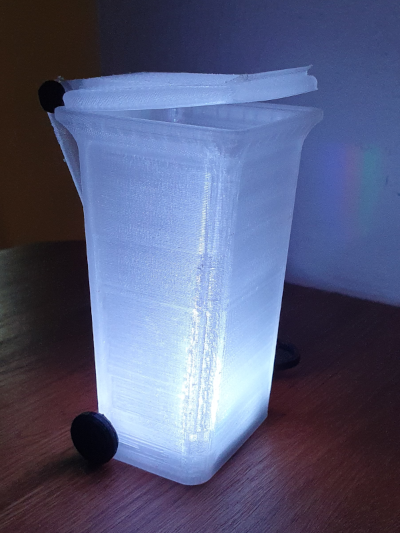

# Waste bin reminder



## Some infos

I liked the idea of an illuminated waste-bin to remind us to put out the rubbish bins. Meanwhile we have 5 different bins, so the task to remind the day and the bin is not as simple as it was years ago :)

### BOM

- Lolin C3 mini
- 3D printed parts

### Software

The software gets the info from a JSON String published on a [server](https://www.weigu.lu/waste_collection/index.php) in the following format:

```JSON
{"2023-01-03":"biomass","2023-01-06":"valorlux","2023-01-11":"waste","2023-01-12":"paper",
 "2023-12-14":"paper","2023-12-19":"biomass","2023-12-22":"valorlux","2023-12-27":"waste"}
```

It uses my ESPToolbox library for WiFi and logging functions (UDP) and to get the time. To avoid version problems the lib is included in the sketch folder. Programming is done over OTA.

All relevant data you must or can change are in a config (`config.h`) file, also contained in the main folder. You can also place this file in the sketchbook/library folder named `Secrets` and rename it to your needs (e.g. `secrets.h`).

In the main file (.ino) you can activate or deactivate features by commenting or uncommenting some lines. Here you can activate `USE_SECRETS`.

The software also publishes the data per `MQTT`.


## All infos on: <http://www.weigu.lu/microcontroller/waste_bin_reminder/index.html>
